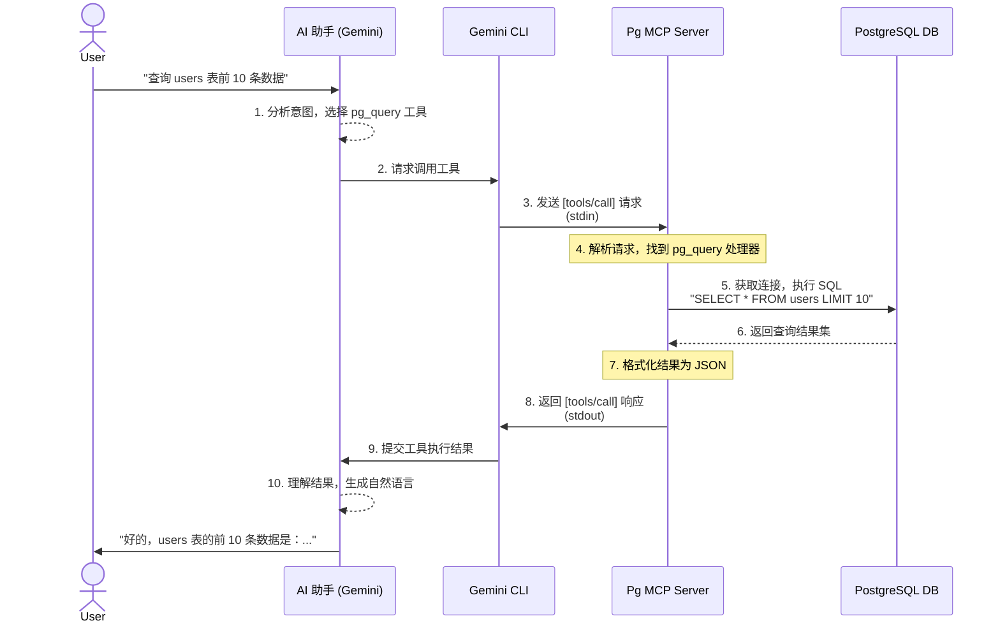

# MCP Server 概念与机制培训文档


> 深入理解 Model Context Protocol 的工作原理与实现机制

---

## 把它想象成“AI 的 USB 协议”

>
> 在 USB 出现之前，连接鼠标、键盘、打印机需要各种不同的接口（PS/2, 并口等），非常混乱。USB 用一个标准统一了所有外设。
> 
> MCP 在 AI 世界里扮演了类似的角色。在 MCP 出现之前，AI 模型调用外部工具（如数据库、API）的方式各不相同。**MCP 提供了一套“即插即用”的标准**，让任何工具都能以统一、安全的方式被 AI 使用。我们这个项目，就是为 PostgreSQL 数据库制作一个符合该标准的“USB 适配器”。

---

## 目录

- [MCP 是什么](#mcp-是什么)
- [MCP 架构与通信机制](#mcp-架构与通信机制)
- [协议数据格式详解](#协议数据格式详解)
- [工具生命周期](#工具生命周期)
- [PostgreSQL MCP Server 实现解析](#postgresql-mcp-server-实现解析)
- [开发实战指南](#开发实战指南)

---

## MCP 是什么

### 背景与定义

**Model Context Protocol (MCP)** 是 Anthropic 于 2024 年提出的开放协议，旨在解决一个核心问题：

> **如何让 AI 模型安全、标准化地调用外部工具？**

在没有 MCP 之前，AI 调用工具的方式五花八门：
- 有的通过 HTTP API
- 有的通过函数调用
- 有的通过插件系统
- 每个平台都有自己的规范

**MCP 提供了一个统一的答案**：所有工具都通过标准协议暴露能力，AI 模型以统一的方式发现和调用它们。

### 核心概念

```
┌─────────────────────────────────────────────────────────────────────┐
│                         MCP 生态系统                                 │
├─────────────────────────────────────────────────────────────────────┤
│                                                                     │
│   ┌──────────────┐              ┌──────────────┐                   │
│   │   MCP Host   │              │  MCP Client  │                   │
│   │  (AI 应用)    │◄───────────►│  (Gemini CLI)│                   │
│   │              │   HTTP/SSE   │              │                   │
│   └──────────────┘              └──────┬───────┘                   │
│                                        │                           │
│                                        │ STDIO (stdin/stdout)      │
│                                        ▼                           │
│                               ┌──────────────┐                    │
│                               │  MCP Server  │                    │
│                               │(本培训项目)   │                    │
│                               └──────┬───────┘                    │
│                                      │                             │
│                                      │ JDBC/SQL                    │
│                                      ▼                             │
│                               ┌──────────────┐                    │
│                               │  外部资源     │                    │
│                               │(PostgreSQL)  │                    │
│                               └──────────────┘                    │
│                                                                     │
└─────────────────────────────────────────────────────────────────────┘
```

| 角色 | 说明 | 示例 |
|------|------|------|
| **MCP Host** | 运行 AI 模型的应用程序 | Gemini Web App、Claude Desktop |
| **MCP Client** | 与 Server 建立连接的客户端 | Gemini CLI、Claude CLI |
| **MCP Server** | 提供工具能力的中间件 | PostgreSQL MCP Server、Git MCP Server |
| **Resources** | Server 连接的外部资源 | 数据库、文件系统、API 服务 |

### MCP 的核心价值

| 价值 | 说明 |
|------|------|
| **一次编写，处处运行** | 写一个 MCP Server，可被任何支持 MCP 的 AI 客户端使用 |
| **标准化接口** | 统一的服务发现、调用、错误处理机制 |
| **安全隔离** | 工具运行在独立进程，通过 STDIO 通信，天然沙箱化 |
| **声明式能力** | 通过 Schema 声明工具能力，AI 自动理解如何使用 |

---

## MCP 架构与通信机制

### 进程模型

MCP Server 以**独立进程**方式运行，这是其安全设计的核心：

```
┌──────────────────────────────────────────────────────────────┐
│                    操作系统进程边界                             │
│  ┌────────────────────────────────────────────────────────┐  │
│  │                    AI Client 进程                       │  │
│  │  ┌─────────────┐      ┌─────────────┐                 │  │
│  │  │   AI 模型    │      │ MCP Client  │                 │  │
│  │  └─────────────┘      └──────┬──────┘                 │  │
│  │                              │                         │  │
│  │                    ┌─────────┴─────────┐               │  │
│  │                    │   stdin/stdout    │               │  │
│  │                    │   (管道通信)       │               │  │
│  │                    └─────────┬─────────┘               │  │
│  └──────────────────────────────┼─────────────────────────┘  │
│                                 │                            │
│  ═══════════════════════════════╪══════════════════════════  │
│                                 │  进程隔离                   │
│  ┌──────────────────────────────┼─────────────────────────┐  │
│  │                    MCP Server 进程                       │  │
│  │  ┌───────────────────────────┴───────────────────────┐  │  │
│  │  │              MCP Server Runtime                     │  │  │
│  │  │  ┌─────────────┐  ┌─────────────┐  ┌─────────────┐ │  │  │
│  │  │  │   Tool 1    │  │   Tool 2    │  │   Tool N    │ │  │  │
│  │  │  │  pg_query   │  │pg_list_tables│  │ pg_execute  │ │  │  │
│  │  │  └─────────────┘  └─────────────┘  └─────────────┘ │  │  │
│  │  └─────────────────────────────────────────────────────┘  │  │
│  └───────────────────────────────────────────────────────────┘  │
└──────────────────────────────────────────────────────────────────┘
```

**进程隔离的优势**：
1. **安全**：工具崩溃不会影响 AI Client
2. **独立**：每个工具集独立运行，互不干扰
3. **灵活**：可以用任何语言实现 Server（Java、Python、Node.js 等）

### 传输层：STDIO

MCP 使用 **STDIO（标准输入输出）** 作为默认传输层：

```
AI Client                         MCP Server
───────────                       ───────────
   │                                   │
   │  ┌───────────────────────────┐   │
   ├──┤  1. 启动 Server 进程       ├──►│   创建子进程
   │  └───────────────────────────┘   │
   │                                   │
   │  ┌───────────────────────────┐   │
   ├──┤  2. 发送初始化请求         ├──►│   写入 Server stdin
   │  │  {"jsonrpc":"2.0",...}     │   │
   │  └───────────────────────────┘   │
   │                                   │
   │  ┌───────────────────────────┐   │
   │◄─┤  3. 接收初始化响应         │───┤   从 Server stdout 读取
   │  │  {"jsonrpc":"2.0",...}     │   │
   │  └───────────────────────────┘   │
   │                                   │
   │  ┌───────────────────────────┐   │
   ├──┤  4. 发送工具调用请求       ├──►│   写入 stdin
   │  │  tools/call               │   │
   │  └───────────────────────────┘   │
   │                                   │
   │  ┌───────────────────────────┐   │
   │◄─┤  5. 接收调用结果           │───┤   从 stdout 读取
   │  │  Tool 执行结果              │   │
   │  └───────────────────────────┘   │
```

**为什么用 STDIO？**
- **简单**：不需要网络配置，没有端口冲突
- **安全**：进程间通信，不暴露网络端口
- **可靠**：操作系统原生支持，稳定可靠
- **轻量**：适合本地工具集成

### 通信流程全景图

```
┌─────────────────────────────────────────────────────────────────────┐
│                     完整的 MCP 交互流程                               │
├─────────────────────────────────────────────────────────────────────┤
│                                                                     │
│  阶段 1: 初始化 (Initialize)                                         │
│  ═══════════════════════════                                        │
│                                                                     │
│  Client ──► Server: initialize                                      │
│  {
│    "jsonrpc": "2.0",
│    "id": 1,
│    "method": "initialize",
│    "params": {
│      "protocolVersion": "2024-11-05",
│      "capabilities": { "tools": {} },
│      "clientInfo": { "name": "gemini", "version": "1.0.0" }
│    }
│  }
│                                                                     │
│  Server ──► Client: 初始化响应                                        │
│  {
│    "jsonrpc": "2.0",
│    "id": 1,
│    "result": {
│      "protocolVersion": "2024-11-05",
│      "capabilities": { "tools": {} },
│      "serverInfo": { "name": "postgres-mcp-server", "version": "1.0.0" }
│    }
│  }
│                                                                     │
│  Client ──► Server: initialized (通知)                               │
│                                                                     │
├─────────────────────────────────────────────────────────────────────┤
│                                                                     │
│  阶段 2: 工具发现 (Tool Discovery)                                    │
│  ═════════════════════════════════                                  │
│                                                                     │
│  Client ──► Server: tools/list                                      │
│                                                                     │
│  Server ──► Client: 工具列表                                          │
│  {
│    "tools": [
│      {
│        "name": "pg_query",
│        "description": "执行 SELECT 查询语句",
│        "inputSchema": { "type": "object", "properties": {...} }
│      },
│      {
│        "name": "pg_list_tables",
│        "description": "列出所有表",
│        "inputSchema": { ... }
│      }
│      // ... 共 18 个工具
│    ]
│  }
│                                                                     │
├─────────────────────────────────────────────────────────────────────┤
│                                                                     │
│  阶段 3: 工具调用 (Tool Invocation)                                   │
│  ══════════════════════════════════                                 │
│                                                                     │
│  用户输入: "查询 users 表的所有数据"                                   │
│                                                                     │
│  AI 模型 ──► 分析意图 ──► 选择工具 pg_query                           │
│                                                                     │
│  Client ──► Server: tools/call                                      │
│  {
│    "jsonrpc": "2.0",
│    "id": 2,
│    "method": "tools/call",
│    "params": {
│      "name": "pg_query",
│      "arguments": { "sql": "SELECT * FROM users" }
│    }
│  }
│                                                                     │
│  Server ──► 执行 SQL ──► PostgreSQL                                  │
│  Server ◄── 返回结果 ◄── PostgreSQL                                  │
│                                                                     │
│  Server ──► Client: 调用结果                                          │
│  {
│    "jsonrpc": "2.0",
│    "id": 2,
│    "result": {
│      "content": [
│        { "type": "text", "text": "[{"id":1,"name":"张三"},...]" }
│      ],
│      "isError": false
│    }
│  }
│                                                                     │
│  AI 模型 ──► 理解结果 ──► 生成自然语言回复                            │
│                                                                     │
│  用户看到: "users 表中有 3 条记录：张三、李四、王五..."                  │
│                                                                     │
└─────────────────────────────────────────────────────────────────────┘
```

### 端到端交互时序图 (示例)



---

## 协议数据格式详解

### JSON-RPC 2.0 基础

MCP 基于 **JSON-RPC 2.0** 协议构建，所有通信都是 JSON 格式：

```json
{
  "jsonrpc": "2.0",      // 协议版本，固定值
  "id": 1,               // 请求标识，用于匹配响应
  "method": "tools/list", // 方法名
  "params": { ... }       // 方法参数
}
```

**消息类型**：
| 类型 | 说明 | 包含字段 |
|------|------|----------|
| **Request** | 客户端发起的请求 | jsonrpc, id, method, params |
| **Response** | 服务器返回的响应 | jsonrpc, id, result/error |
| **Notification** | 单向通知，不需要响应 | jsonrpc, method, params（无 id） |

### 工具定义 Schema

工具的能力通过 **JSON Schema** 声明：

```json
{
  "name": "pg_create_table",
  "description": "创建新表，支持定义列、主键、外键等",
  "inputSchema": {
    "type": "object",
    "properties": {
      "tableName": {
        "type": "string",
        "description": "表名"
      },
      "schema": {
        "type": "string",
        "description": "Schema 名称",
        "default": "public"
      },
      "columns": {
        "type": "array",
        "description": "列定义数组",
        "items": {
          "type": "object",
          "properties": {
            "name": { "type": "string" },
            "type": { "type": "string" },
            "notNull": { "type": "boolean" },
            "primaryKey": { "type": "boolean" },
            "default": { "type": "string" }
          }
        }
      },
      "ifNotExists": {
        "type": "boolean",
        "description": "如果不存在则创建",
        "default": true
      }
    },
    "required": ["tableName", "columns"]
  }
}
```

**Schema 的作用**：

1. **AI 理解**：告诉 AI 这个工具能做什么
2. **参数校验**：验证调用参数是否符合要求
3. **类型安全**：确保数据类型正确
4. **IDE 支持**：提供自动补全和校验

### 工具调用与响应

**调用请求**：
```json
{
  "jsonrpc": "2.0",
  "id": 5,
  "method": "tools/call",
  "params": {
    "name": "pg_create_table",
    "arguments": {
      "tableName": "users",
      "schema": "public",
      "columns": [
        {
          "name": "id",
          "type": "SERIAL",
          "primaryKey": true
        },
        {
          "name": "name",
          "type": "VARCHAR(100)",
          "notNull": true
        }
      ]
    }
  }
}
```

**成功响应**：
```json
{
  "jsonrpc": "2.0",
  "id": 5,
  "result": {
    "content": [
      {
        "type": "text",
        "text": "表 'public.users' 创建成功"
      }
    ],
    "isError": false
  }
}
```

**错误响应**：
```json
{
  "jsonrpc": "2.0",
  "id": 5,
  "result": {
    "content": [
      {
        "type": "text",
        "text": "SQL 错误: 表 'users' 已存在"
      }
    ],
    "isError": true
  }
}
```

**注意**：MCP 协议中，即使业务逻辑出错（如 SQL 执行失败），HTTP 层仍然返回 200，通过 `isError` 字段标识错误状态。

### 内容类型

MCP 支持多种内容类型：

| 类型 | 用途 | 示例 |
|------|------|------|
| `text` | 纯文本内容 | 查询结果、状态信息 |
| `image` | 图片数据 | 数据可视化图表 |
| `resource` | 资源引用 | 文件链接、文档 |

```json
// 图片内容示例
{
  "type": "image",
  "data": "/9j/4AAQSkZJRgABAQAAAQ...",  // base64 编码
  "mimeType": "image/png"
}
```

---

## 工具生命周期

### 工具注册与发现

```
┌─────────────────────────────────────────────────────────────────┐
│                      工具生命周期                                │
├─────────────────────────────────────────────────────────────────┤
│                                                                 │
│   1. 开发阶段                                                    │
│   ┌──────────────┐     ┌──────────────┐     ┌──────────────┐   │
│   │  编写业务逻辑 │ ──► │ 定义 Schema  │ ──► │ 注册到 Server │   │
│   │  (Handler)   │     │  (inputSchema)│     │  (tool())    │   │
│   └──────────────┘     └──────────────┘     └──────────────┘   │
│                                                                 │
│   2. 部署阶段                                                    │
│   ┌──────────────┐     ┌──────────────┐     ┌──────────────┐   │
│   │  打包 JAR    │ ──► │ 配置 AI Client│ ──► │ 启动 Server  │   │
│   │  (mvn package)│     │ (config.yaml) │     │  (java -jar) │   │
│   └──────────────┘     └──────────────┘     └──────────────┘   │
│                                                                 │
│   3. 运行阶段                                                    │
│   ┌──────────────┐     ┌──────────────┐     ┌──────────────┐   │
│   │  Client 连接 │ ──► │ 发送 list 请求│ ──► │ Server 返回   │   │
│   │              │     │              │     │ 工具列表      │   │
│   └──────────────┘     └──────────────┘     └──────────────┘   │
│          │                                                      │
│          ▼                                                      │
│   ┌──────────────┐     ┌──────────────┐     ┌──────────────┐   │
│   │ AI 选择工具  │ ──► │ 发送 call 请求│ ──► │ Server 执行   │   │
│   │              │     │              │     │ 返回结果      │   │
│   └──────────────┘     └──────────────┘     └──────────────┘   │
│                                                                 │
│   4. 销毁阶段                                                    │
│   ┌──────────────┐     ┌──────────────┐                        │
│   │ Client 断开  │ ──► │ 执行 shutdown │ ──► 释放资源          │
│   │              │     │  (关闭连接池)  │     (数据库连接等)     │
│   └──────────────┘     └──────────────┘                        │
│                                                                 │
└─────────────────────────────────────────────────────────────────┘
```

### AI 如何选择工具？

**一个典型的场景：**

> **你 (对 AI 助手说):** “嘿，帮我看看 `cspcp_dev` 这个 schema 下面都有哪些表？”
>
> **AI (内心活动):**
> 1.  **用户意图识别**: 核心是“看表”、“列出表”。
> 2.  **搜索工具箱**:
>     - `pg_query`: “执行 SELECT 查询”，嗯...有点关系，但不够直接。
>     - `pg_list_tables`: “列出指定 Schema 中的所有表”，**完美匹配！**
>     - `pg_describe_table`: “获取表结构”，这是看单个表的内部，不是我想要的。
> 3.  **检查“说明书” (inputSchema)**: `pg_list_tables` 需要一个 `schema` 参数，用户已经告诉我了，就是 `cspcp_dev`。太好了，信息充足！
> 4.  **生成指令 (调用工具)**: `tools/call(name: "pg_list_tables", arguments: { "schema": "cspcp_dev" })`
>
> **AI (回复你):** “好的，`cspcp_dev` schema 下有以下表格：`users`, `orders`, `products` ...”

**AI 思考过程:** 
```
用户输入: "查看数据库中有哪些表"

AI 思考过程:
┌──────────────────────────────────────────────────────┐
│ 1. 分析用户意图                                       │
│    - 关键词："查看"、"哪些表"                          │
│    - 意图：列出数据库表                                │
├──────────────────────────────────────────────────────┤
│ 2. 匹配可用工具                                       │
│    工具列表：                                          │
│    - pg_query: "执行 SELECT 查询语句" ◄── 可能匹配      │
│    - pg_list_tables: "列出指定 Schema 中的所有表" ◄── 最佳匹配 │
│    - pg_describe_table: "获取表结构详情"               │
│    - pg_create_table: "创建新表"                       │
├──────────────────────────────────────────────────────┤
│ 3. 检查参数要求                                       │
│    pg_list_tables 参数：                               │
│    - schema: 可选，默认 "public"                       │
│    - 结论：无需用户提供额外参数                          │
├──────────────────────────────────────────────────────┤
│ 4. 生成工具调用                                        │
│    {
│      "name": "pg_list_tables",
│      "arguments": { "schema": "public" }
│    }
│                                                   │
└──────────────────────────────────────────────────────┘
```

**关键设计**：工具的 `description` 至关重要，它直接影响 AI 的选择准确性。

### 错误处理机制

```
┌─────────────────────────────────────────────────────────────────┐
│                      错误处理流程                                │
├─────────────────────────────────────────────────────────────────┤
│                                                                 │
│  场景 1: 参数校验失败                                             │
│  ───────────────────                                             │
│  Client ──► Server: tools/call (缺少必填参数)                     │
│  Server ──► Client: 返回错误 (isError: true)                      │
│  AI ──► 理解错误 ──► 向用户询问缺失参数                            │
│                                                                 │
│  场景 2: 业务逻辑错误                                             │
│  ───────────────────                                             │
│  Client ──► Server: tools/call (执行非法 SQL)                     │
│  Server ──► 安全检查拦截 ──► 返回错误                              │
│  AI ──► 理解错误 ──► 提示用户操作被拒绝                            │
│                                                                 │
│  场景 3: 运行时异常                                               │
│  ───────────────────                                             │
│  Client ──► Server: tools/call                                    │
│  Server ──► 执行时异常 ──► 返回错误信息                            │
│  AI ──► 理解错误 ──► 提示用户操作失败原因                          │
│                                                                 │
│  场景 4: 连接断开                                                 │
│  ───────────────────                                             │
│  Server 进程崩溃 / 网络中断                                        │
│  Client ──► 检测到 EOF ──► 尝试重新连接                            │
│  或提示用户检查 Server 状态                                       │
│                                                                 │
└─────────────────────────────────────────────────────────────────┘
```

---

## PostgreSQL MCP Server 实现解析

### 系统架构

```
┌─────────────────────────────────────────────────────────────────────┐
│                  PostgreSQL MCP Server 架构                          │
├─────────────────────────────────────────────────────────────────────┤
│                                                                     │
│  ┌───────────────────────────────────────────────────────────────┐  │
│  │                    MCP 协议层                                  │  │
│  │  ┌─────────────┐  ┌─────────────┐  ┌─────────────┐             │ │
│  │  │ 请求解析器   │  │ 路由分发器   │  │ 响应构造器   │            │  │
│  │  │(JSON-RPC)   │──►│(Method Router)│──►│(JSON Encoder)│       │  │
│  │  └─────────────┘  └─────────────┘  └─────────────┘            │  │
│  │                              │                                │  │
│  └──────────────────────────────┼────────────────────────────────┘  │
│                                 │                                   │
│  ┌──────────────────────────────┼────────────────────────────────┐  │
│  │                    工具管理层                                  │  │
│  │                              ▼                                │  │
│  │  ┌──────────────────────────────────────────────────────────┐ │  │
│  │  │                    PgsqlTools                            │ │  │
│  │  │  ┌──────────┐ ┌──────────┐ ┌──────────┐ ┌──────────┐     │ │  │
│  │  │  │Schema管理 │ │ 表管理    │ │ 索引管理  │ │ 数据操作  │   │ │  │
│  │  │  │(3 个工具) │ │(6 个工具) │ │(4 个工具) │ │(1 个工具) │   │ │  │
│  │  │  └──────────┘ └──────────┘ └──────────┘ └──────────┘     │ │  │
│  │  │  ┌──────────┐ ┌──────────┐ ┌─────────────────────────┐   │ │  │
│  │  │  │数据库信息 │ │ 基础查询  │ │    Schema 比较工具       │  │ │  │
│  │  │  │(2 个工具) │ │(1 个工具) │ │    (1 个高级工具)        │  │ │  │
│  │  │  └──────────┘ └──────────┘ └─────────────────────────┘   │ │  │
│  │  └─────────────────────────────────────────────────────────┘  │  │
│  └───────────────────────────────────────────────────────────────┘  │
│                                 │                                   │
│  ┌──────────────────────────────┼────────────────────────────────┐  │
│  │                    数据访问层                                  │  │
│  │                              ▼                                │  │
│  │  ┌─────────────────┐    ┌─────────────────┐                   │  │
│  │  │   HikariCP      │    │   JDBC Driver   │                   │  │
│  │  │  连接池管理      │───►│  PostgreSQL     │                   │  │
│  │  │ (连接复用/监控)  │    │ (42.7.3)        │                   │  │
│  │  └─────────────────┘    └─────────────────┘                   │  │
│  └───────────────────────────────────────────────────────────────┘  │
│                                 │                                   │
│                                 ▼                                   │
│                       ┌─────────────────┐                           │
│                       │   PostgreSQL    │                           │
│                       │    Database     │                           │
│                       └─────────────────┘                           │
│                                                                     │
└─────────────────────────────────────────────────────────────────────┘
```

### 连接池设计原理

**为什么需要连接池？**

```
无连接池（每次新建连接）：
Client ──► 创建连接(100ms) ──► 执行 SQL(10ms) ──► 关闭连接(20ms) ──► 响应
总耗时: 130ms

有连接池（复用已有连接）：
Client ──► 获取连接(1ms) ──► 执行 SQL(10ms) ──► 归还连接(1ms) ──► 响应
总耗时: 12ms

性能提升: 10 倍以上
```

**MCP 场景的连接池配置**：

```java
config.setMaximumPoolSize(3);        // 为什么只有 3 个？
config.setMinimumIdle(1);            // 保持 1 个空闲连接
```

原因分析：
- MCP Server 是**单用户**场景（一个 AI Client 对应一个 Server）
- AI 调用是**串行**的（不会同时执行多个工具）
- 3 个连接足够应对：主连接 + 并发查询 + 备用

### 安全沙箱机制

```
┌─────────────────────────────────────────────────────────────────┐
│                     多层安全防护体系                             │
├─────────────────────────────────────────────────────────────────┤
│                                                                 │
│  第 1 层: 进程隔离                                                 │
│  ─────────────────                                               │
│  • MCP Server 运行在独立进程                                      │
│  • 崩溃不会影响 AI Client                                         │
│  • 资源限制（CPU/内存）可通过 OS 控制                              │
│                                                                 │
│  第 2 层: 协议安全                                                 │
│  ─────────────────                                               │
│  • 仅通过 STDIO 通信，无网络暴露                                  │
│  • JSON-RPC 格式校验，拒绝非法请求                                 │
│  • 请求/响应 ID 匹配，防止请求劫持                                 │
│                                                                 │
│  第 3 层: SQL 安全检查                                             │
│  ─────────────────                                               │
│  • 危险操作拦截（DROP DATABASE/SCHEMA 等）                         │
│  • 标识符转义，防止 SQL 注入                                      │
│  • 只读/读写权限分离                                              │
│                                                                 │
│  第 4 层: 数据库权限                                               │
│  ─────────────────                                               │
│  • 使用最小权限原则配置数据库用户                                  │
│  • 建议生产环境使用只读用户                                        │
│  • 通过数据库自身的权限系统控制                                    │
│                                                                 │
└─────────────────────────────────────────────────────────────────┘
```

### Schema 比较机制

**解决一个经典难题：环境同步**

> 想象一个场景：
> -   **生产环境 (Production)** 的数据库结构是黄金标准。
> -   **开发环境 (Staging)** 经过多人协作，结构可能已经被改得面目全非（有人加了字段，有人改了类型，有人忘了加索引）。
>
> 现在，我们需要将 `Staging` 的改动发布到 `Production`，或者反过来，将 `Production` 的结构同步到 `Staging`。**手动比对数据库结构是一场噩梦**，耗时、易错，还可能导致线上故障。
>
> `pg_compare_schemas` 工具就是为了解决这个痛点而生。它能像一个火眼金睛的 DBA 一样，自动、精确地比对两个 Schema 的所有差异，并生成可直接执行的同步 DDL 脚本。

**工作流程**
```
┌─────────────────────────────────────────────────────────────────┐
│                    Schema 比较工作流程                           │
├─────────────────────────────────────────────────────────────────┤
│                                                                 │
│  输入: sourceSchema="production", targetSchema="staging"          │
│                                                                 │
│  步骤 1: 元数据提取                                               │
│  ┌─────────────┐ ┌─────────────┐ ┌─────────────┐               │
│  │ 提取表结构   │ │ 提取索引     │ │ 提取约束     │               │
│  │(information_ │ │(pg_indexes) │ │(table_constr-│               │
│  │ schema.tables)│              │ │ aints)       │               │
│  └─────────────┘ └─────────────┘ └─────────────┘               │
│                                                                 │
│  步骤 2: 差异比对                                                 │
│  ┌─────────────────────────────────────────────────────────┐   │
│  │  production.users                  staging.users         │   │
│  │  ├─ id: SERIAL                     ├─ id: SERIAL         │   │
│  │  ├─ name: VARCHAR(100)             ├─ name: VARCHAR(100)  │   │
│  │  ├─ email: VARCHAR(255)     ≠      ├─ email: VARCHAR(100) │   │
│  │  ├─ phone: VARCHAR(20)      ≠      (缺失)                 │   │
│  │  └─ created_at: TIMESTAMP          └─ created_at: TIMESTAMP│   │
│  │                                                          │   │
│  │  差异:                                                   │   │
│  │  1. email 列长度不同                                      │   │
│  │  2. phone 列在 target 中缺失                              │   │
│  └─────────────────────────────────────────────────────────┘   │
│                                                                 │
│  步骤 3: 生成同步脚本                                             │
│  ┌─────────────────────────────────────────────────────────┐   │
│  │  ALTER TABLE staging.users                              │   │
│  │    ALTER COLUMN email TYPE VARCHAR(255);                │   │
│  │                                                         │   │
│  │  ALTER TABLE staging.users                              │   │
│  │    ADD COLUMN phone VARCHAR(20);                        │   │
│  └─────────────────────────────────────────────────────────┘   │
│                                                                 │
│  输出: 详细的差异报告 + 可执行的同步 DDL 脚本                      │
│                                                                 │
└─────────────────────────────────────────────────────────────────┘
```

---

## 开发实战指南

### 从 0 到 1 开发 MCP Server

**步骤 1：项目初始化**
```xml
<!-- pom.xml 核心依赖 -->
<dependencies>
    <dependency>
        <groupId>io.modelcontextprotocol.sdk</groupId>
        <artifactId>mcp</artifactId>
        <version>0.7.0</version>
    </dependency>
</dependencies>
```

**步骤 2：编写主类**
```java
public class MyMcpServer {
    public static void main(String[] args) throws InterruptedException {
        var transport = new StdioServerTransport();
        
        McpSyncServer server = McpServer.sync(transport)
            .serverInfo("my-mcp-server", "1.0.0")
            .tool(getMyTool(), getMyHandler())
            .build();
        
        Thread.currentThread().join();
    }
}
```

**步骤 3：定义工具**
```java
public Tool getMyTool() {
    return new Tool(
        "my_tool",
        "工具描述，帮助 AI 理解用途",
        """
        {
            "type": "object",
            "properties": {
                "param": {"type": "string", "description": "参数说明"}
            },
            "required": ["param"]
        }
        """
    );
}

public Function<Map<String, Object>, CallToolResult> getMyHandler() {
    return args -> {
        String param = (String) args.get("param");
        // 业务逻辑...
        return new CallToolResult(
            List.of(new TextContent("结果")),
            false
        );
    };
}
```

**步骤 4：配置 AI Client**
```yaml
# config.yaml
mcpServers:
  myserver:
    command: "java"
    args: ["-jar", "/path/to/my-mcp-server.jar"]
```

### 常见陷阱与解决方案

| 问题 | 原因 | 解决方案 |
|------|------|----------|
| Server 启动后立即退出 | 主线程结束 | 使用 `Thread.currentThread().join()` |
| 输出到 stdout 导致协议混乱 | 日志输出到 stdout | 使用 `System.err.println()` |
| AI 无法识别工具 | description 不清晰 | 写清楚工具用途和参数含义 |
| 工具调用超时 | 执行时间太长 | 优化 SQL 或增加异步处理 |
| 中文乱码 | 编码问题 | 确保使用 UTF-8 编码 |

---

## 总结

### 核心要点回顾

1. **MCP 的本质**：标准化 AI 与外部工具的通信协议
2. **进程隔离**：Server 独立运行，通过 STDIO 通信
3. **JSON-RPC 协议**：所有交互都是结构化的 JSON 消息
4. **工具定义**：通过 Schema 声明能力，AI 自动理解使用方式
5. **生命周期**：初始化 → 发现 → 调用 → 销毁

### 进一步学习资源

- [MCP 官方文档](https://modelcontextprotocol.io)
- [MCP Java SDK](https://github.com/modelcontextprotocol/java-sdk)
- [MCP Inspector 调试工具](https://github.com/modelcontextprotocol/inspector)

---

