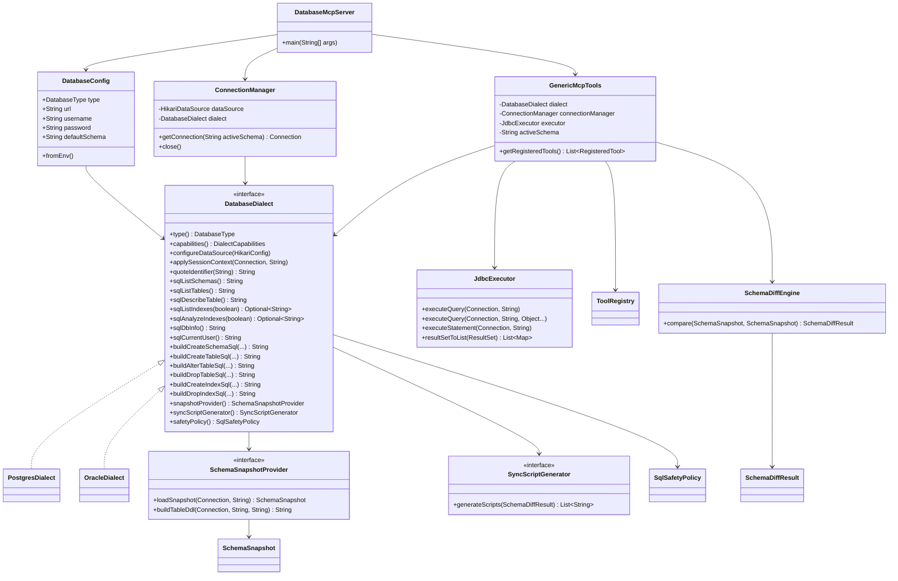

# Oracle Support Refactor Design

## Goal

Refactor the current PostgreSQL-only MCP server into a database-extensible MCP server that can support both PostgreSQL and Oracle with a shared tool surface and dialect-specific implementations.

This design prioritizes:

- keeping existing PostgreSQL behavior stable
- minimizing `if (oracle)` branches in business code
- isolating dialect-specific SQL and DDL logic
- allowing gradual rollout with partial Oracle support

## Current State

The project currently has three core classes:

- `PostgresMcpServer`
- `PgsqlTools`
- `SchemaComparator`

### Main coupling points

1. Server bootstrap is PostgreSQL-specific.
   - Reads `PG_URL`, `PG_USER`, `PG_PASSWORD`
   - Creates `PgsqlTools`
   - Registers `pg_*` tool names

2. `PgsqlTools` mixes multiple responsibilities.
   - Hikari datasource configuration
   - session schema switching
   - MCP tool schema definitions
   - SQL execution
   - SQL safety filtering
   - PostgreSQL metadata queries
   - PostgreSQL DDL generation

3. `SchemaComparator` is PostgreSQL-specific.
   - depends on `information_schema`
   - depends on `pg_indexes`, `pg_views`, `pg_proc`
   - emits PostgreSQL-style sync SQL directly

Because of this structure, adding Oracle directly would create a large number of conditional branches and make the code hard to maintain.

## Target Architecture

The refactor should separate:

- protocol layer
- execution layer
- dialect layer
- metadata/snapshot layer
- diff layer
- sync SQL generation layer

### Proposed package layout

```text
src/main/java/com/example/mcp/
├─ bootstrap/
│  └─ DatabaseMcpServer.java
├─ config/
│  ├─ DatabaseConfig.java
│  └─ DatabaseType.java
├─ dialect/
│  ├─ DatabaseDialect.java
│  ├─ DialectCapabilities.java
│  ├─ postgres/
│  │  ├─ PostgresDialect.java
│  │  ├─ PostgresSnapshotProvider.java
│  │  └─ PostgresSyncScriptGenerator.java
│  └─ oracle/
│     ├─ OracleDialect.java
│     ├─ OracleSnapshotProvider.java
│     └─ OracleSyncScriptGenerator.java
├─ execution/
│  ├─ ConnectionManager.java
│  ├─ JdbcExecutor.java
│  └─ SqlSafetyPolicy.java
├─ model/
│  ├─ ColumnDef.java
│  ├─ TableDef.java
│  ├─ IndexDef.java
│  ├─ ConstraintDef.java
│  ├─ ViewDef.java
│  ├─ RoutineDef.java
│  ├─ SequenceDef.java
│  └─ SchemaSnapshot.java
├─ schema/
│  ├─ SchemaSnapshotProvider.java
│  ├─ SchemaDiffEngine.java
│  ├─ SchemaDiffResult.java
│  └─ SyncScriptGenerator.java
└─ tools/
   ├─ GenericMcpTools.java
   └─ ToolRegistry.java
```

## Detailed Class Diagram



## Runtime Flow

### Server bootstrap flow

```text
env vars
  -> DatabaseConfig.fromEnv()
  -> DatabaseDialectFactory.create(config.type)
  -> ConnectionManager(config, dialect)
  -> JdbcExecutor(objectMapper)
  -> GenericMcpTools(dialect, connectionManager, executor)
  -> ToolRegistry.registerAll(serverBuilder, genericMcpTools)
  -> MCP server start
```

### Read-only query flow

```text
MCP request
  -> GenericMcpTools.getQueryHandler()
  -> dialect.safetyPolicy().validateReadOnly(sql)
  -> connectionManager.getConnection(activeSchema)
  -> executor.executeQuery(...)
  -> JSON result
```

### Schema compare flow

```text
MCP request
  -> GenericMcpTools.getCompareSchemasHandler()
  -> connectionManager.getConnection(activeSchema)
  -> dialect.snapshotProvider().loadSnapshot(sourceSchema)
  -> dialect.snapshotProvider().loadSnapshot(targetSchema)
  -> schemaDiffEngine.compare(source, target)
  -> dialect.syncScriptGenerator().generateScripts(diff)
  -> formatted report
```

## Concrete Class Responsibilities

### `bootstrap.DatabaseMcpServer`

Responsibilities:

- read and validate runtime config
- create dialect from config
- create infrastructure objects
- register tools into MCP server
- own shutdown hook

Should not:

- execute SQL
- contain dialect-specific logic
- know metadata query details

### `config.DatabaseConfig`

Responsibilities:

- parse env vars
- provide backward compatibility for old PostgreSQL-only variables
- normalize config defaults

Recommended behavior:

- `DB_TYPE` values: `postgres`, `oracle`
- default `DB_TYPE=postgres` if only legacy `PG_*` vars are present
- default schema:
  - PostgreSQL: `public`
  - Oracle: current user unless `DB_SCHEMA` is set

### `dialect.DatabaseDialectFactory`

Add a small factory class:

```java
public final class DatabaseDialectFactory {
    public static DatabaseDialect create(DatabaseType type) {
        return switch (type) {
            case POSTGRES -> new PostgresDialect();
            case ORACLE -> new OracleDialect();
        };
    }
}
```

This keeps bootstrap logic simple and makes later dialect additions easy.

### `execution.ConnectionManager`

Suggested constructor:

```java
public ConnectionManager(DatabaseConfig config, DatabaseDialect dialect)
```

Responsibilities:

- initialize `HikariConfig`
- call `dialect.configureDataSource(config)`
- create `HikariDataSource`
- provide connections with dialect-specific session setup

Suggested public API:

```java
public Connection getConnection(String activeSchema) throws SQLException
public void close()
```

### `execution.JdbcExecutor`

Suggested methods:

```java
public List<Map<String, Object>> query(Connection conn, String sql) throws SQLException
public List<Map<String, Object>> query(Connection conn, String sql, List<Object> params) throws SQLException
public StatementResult execute(Connection conn, String sql) throws SQLException
public String toJson(List<Map<String, Object>> rows) throws JsonProcessingException
```

Suggested helper DTO:

```java
public record StatementResult(
    boolean hasResultSet,
    List<Map<String, Object>> rows,
    int updateCount
) {}
```

This removes repeated JDBC boilerplate from each tool handler.

### `execution.SqlSafetyPolicy`

Current code has PostgreSQL-oriented SQL blocking rules. Move them behind a strategy object.

Suggested API:

```java
public interface SqlSafetyPolicy {
    Optional<String> validateReadOnly(String sql);
    Optional<String> validateExecute(String sql);
}
```

Recommended concrete classes:

- `PostgresSqlSafetyPolicy`
- `OracleSqlSafetyPolicy`

Both can share a `BaseSqlSafetyPolicy` for common logic like:

- blank SQL rejection
- comment stripping
- multi-statement rejection for read-only queries

### `tools.GenericMcpTools`

This becomes the main MCP integration point.

Suggested constructor:

```java
public GenericMcpTools(
    DatabaseDialect dialect,
    ConnectionManager connectionManager,
    JdbcExecutor executor,
    ObjectMapper objectMapper
)
```

Responsibilities:

- keep active schema state
- define tool JSON schemas
- map tool request args to dialect/executor calls
- check dialect capabilities before invoking unsupported operations
- format tool outputs

### `tools.ToolRegistry`

Instead of registering 18 tools inline in `main`, move registration into a registry helper.

Suggested API:

```java
public final class ToolRegistry {
    public static void register(McpServer.SyncSpecification.Builder builder, GenericMcpTools tools) {
        ...
    }
}
```

Benefits:

- cleaner bootstrap
- easier to add aliases (`pg_*` and `db_*`)
- keeps registration order explicit

## Interface Drafts

### `DatabaseDialect`

Below is a more concrete draft than the earlier sketch.

```java
public interface DatabaseDialect {
    DatabaseType type();
    String serverName();
    String serverVersion();
    DialectCapabilities capabilities();

    void configureDataSource(HikariConfig config);
    void applySessionContext(Connection connection, String activeSchema) throws SQLException;

    String quoteIdentifier(String identifier);
    boolean isSafeIdentifier(String identifier);

    String sqlListSchemas();
    String sqlListTables();
    String sqlDescribeTable();
    Optional<String> sqlListIndexes(boolean hasTableFilter);
    Optional<String> sqlAnalyzeIndexes(boolean hasTableFilter);
    String sqlDbInfo();
    String sqlCurrentUser();

    String buildCreateSchemaSql(String schema, boolean ifNotExists);
    String buildCreateTableSql(String schema, String tableName, List<Map<String, Object>> columns, boolean ifNotExists);
    String buildAlterTableSql(String schema, String tableName, String action, Map<String, Object> args);
    String buildDropTableSql(String schema, String tableName, boolean ifExists, boolean cascade);
    String buildCreateIndexSql(String schema, String tableName, String indexName, List<String> columns, boolean unique, boolean ifNotExists);
    String buildDropIndexSql(String schema, String indexName, boolean ifExists);

    SchemaSnapshotProvider snapshotProvider();
    SyncScriptGenerator syncScriptGenerator();
    SqlSafetyPolicy safetyPolicy();
}
```

### `SchemaSnapshotProvider`

```java
public interface SchemaSnapshotProvider {
    SchemaSnapshot loadSnapshot(Connection connection, String schema) throws SQLException;
    String buildTableDdl(Connection connection, String schema, String tableName) throws SQLException;
}
```

### `SyncScriptGenerator`

```java
public interface SyncScriptGenerator {
    List<String> generateScripts(SchemaDiffResult diffResult);
}
```

### `SchemaDiffEngine`

```java
public final class SchemaDiffEngine {
    public SchemaDiffResult compare(SchemaSnapshot source, SchemaSnapshot target) {
        ...
    }
}
```

## Proposed Model Layer

The current `SchemaComparator` nested classes should be promoted into top-level model classes or records.

### Recommended model set

```text
model/
├─ SchemaSnapshot.java
├─ TableDef.java
├─ ColumnDef.java
├─ IndexDef.java
├─ ConstraintDef.java
├─ ViewDef.java
├─ RoutineDef.java
├─ SequenceDef.java
├─ SchemaDiffResult.java
├─ TableDiff.java
├─ ColumnDiff.java
├─ IndexDiff.java
├─ ConstraintDiff.java
├─ ViewDiff.java
├─ RoutineDiff.java
└─ SequenceDiff.java
```

### Why move away from nested classes

- easier reuse across dialect implementations
- easier unit testing
- easier serialization if later needed
- avoids a giant monolithic diff file

## PostgreSQL-to-New-Architecture Mapping

This section maps current code into future modules so migration is straightforward.

### Current `PostgresMcpServer`

Move to:

- `bootstrap.DatabaseMcpServer`
- `tools.ToolRegistry`

### Current `PgsqlTools`

Split into:

- datasource setup -> `ConnectionManager` + `PostgresDialect.configureDataSource`
- session schema switching -> `PostgresDialect.applySessionContext`
- SQL execution helpers -> `JdbcExecutor`
- SQL safety checks -> `PostgresSqlSafetyPolicy`
- tool definitions -> `GenericMcpTools`
- PostgreSQL metadata SQL -> `PostgresDialect`
- compare/report formatting -> `GenericMcpTools` + `SchemaDiffEngine`

### Current `SchemaComparator`

Split into:

- PG metadata extraction -> `PostgresSnapshotProvider`
- Java diff logic -> `SchemaDiffEngine`
- PG sync SQL generation -> `PostgresSyncScriptGenerator`
- report formatting -> `GenericMcpTools`

## Oracle Mapping Notes

### `sqlListSchemas`

Candidate direction:

- PostgreSQL: `information_schema.schemata`
- Oracle: `ALL_USERS`

### `sqlListTables`

Candidate direction:

- PostgreSQL: `information_schema.tables`
- Oracle: `ALL_TABLES`

### `sqlDescribeTable`

Candidate direction:

- PostgreSQL: `information_schema.columns` plus comments
- Oracle: `ALL_TAB_COLUMNS` plus `ALL_COL_COMMENTS`

### `sqlListIndexes`

Candidate direction:

- PostgreSQL: `pg_indexes`
- Oracle: `ALL_INDEXES` joined with `ALL_IND_COLUMNS`

### `sqlDbInfo`

Candidate direction:

- PostgreSQL: `current_database()`, `version()`, `pg_database_size(...)`
- Oracle: instance/version info from system views where available, otherwise a minimal query using `SYS_CONTEXT`

Note:

- Oracle db info may need to degrade gracefully if dictionary view privileges are limited.

## Tool-by-Tool Support Matrix

| Tool | PostgreSQL | Oracle v1 | Notes |
|---|---|---|---|
| `query` | Full | Full | read-only SQL |
| `execute` | Full | Full | DDL/DML execution |
| `switch_schema` | Full | Full | different session syntax |
| `list_schemas` | Full | Full | semantics differ slightly |
| `create_schema` | Full | Unsupported | Oracle schema != PostgreSQL schema |
| `list_tables` | Full | Full | use engine-specific catalogs |
| `describe_table` | Full | Full | engine-specific metadata SQL |
| `create_table` | Full | Full | `IF NOT EXISTS` emulated in Oracle |
| `alter_table` | Full | Partial/Full | action-specific syntax differences |
| `drop_table` | Full | Full | `IF EXISTS` emulated in Oracle |
| `get_ddl` | Full | Full | from snapshot provider |
| `list_indexes` | Full | Full | use `ALL_INDEXES` and `ALL_IND_COLUMNS` |
| `create_index` | Full | Full | `IF NOT EXISTS` emulated in Oracle |
| `drop_index` | Full | Full | existence check may be needed |
| `analyze_index` | Full | Unsupported | privilege-sensitive in Oracle |
| `db_info` | Full | Partial | depends on accessible dictionary views |
| `current_user` | Full | Full | different SQL |
| `compare_schemas` | Full | Partial | v1 can skip complex routines |

## Migration Checklist

### Phase 1 checklist

- add `config` package
- add `dialect` package
- add `execution` package
- add `tools/ToolRegistry`
- rename bootstrap class to generic server entry
- keep current PostgreSQL runtime working

### Phase 2 checklist

- create `GenericMcpTools`
- migrate all 18 tool definitions
- keep old `pg_*` names stable
- centralize SQL execution in `JdbcExecutor`
- centralize safety checks in policy class

### Phase 3 checklist

- create `SchemaSnapshotProvider`
- extract snapshot model classes
- extract `SchemaDiffEngine`
- extract `PostgresSyncScriptGenerator`
- verify `get_ddl` and `compare_schemas`

### Phase 4 checklist

- add Oracle dependency strategy
- implement `OracleDialect`
- implement `OracleSnapshotProvider`
- implement unsupported-capability responses
- add Oracle docs and env examples

## Detailed File Migration Plan

### Files to add first

```text
src/main/java/com/example/mcp/config/DatabaseType.java
src/main/java/com/example/mcp/config/DatabaseConfig.java
src/main/java/com/example/mcp/dialect/DatabaseDialect.java
src/main/java/com/example/mcp/dialect/DialectCapabilities.java
src/main/java/com/example/mcp/dialect/DatabaseDialectFactory.java
src/main/java/com/example/mcp/dialect/postgres/PostgresDialect.java
src/main/java/com/example/mcp/execution/ConnectionManager.java
src/main/java/com/example/mcp/execution/JdbcExecutor.java
src/main/java/com/example/mcp/execution/SqlSafetyPolicy.java
src/main/java/com/example/mcp/tools/ToolRegistry.java
```

### Files to add in schema split phase

```text
src/main/java/com/example/mcp/schema/SchemaSnapshotProvider.java
src/main/java/com/example/mcp/schema/SchemaDiffEngine.java
src/main/java/com/example/mcp/schema/SyncScriptGenerator.java
src/main/java/com/example/mcp/model/SchemaSnapshot.java
src/main/java/com/example/mcp/model/TableDef.java
src/main/java/com/example/mcp/model/ColumnDef.java
src/main/java/com/example/mcp/model/SchemaDiffResult.java
...
```

### Files likely to be removed eventually

```text
src/main/java/com/example/mcp/PgsqlTools.java
src/main/java/com/example/mcp/SchemaComparator.java
src/main/java/com/example/mcp/PostgresMcpServer.java
```

These should only be removed after the new architecture is in place and verified.

## Suggested MCP Tool Registration Strategy

To support both legacy and future naming:

```java
register("pg_query", tools.getQueryTool(), tools.getQueryHandler());
register("db_query", tools.getQueryToolAlias("db_query"), tools.getQueryHandler());
```

Recommended implementation:

- internal method per logical tool
- registration layer decides the public tool name

This avoids duplicating handler logic.

## Error Handling Strategy

Standardize error formatting before the refactor spreads.

### Recommended categories

- config error
- unsupported operation
- validation error
- SQL error
- timeout error
- permission error

Suggested helper:

```java
public final class ToolResults {
    public static McpSchema.CallToolResult success(String message) { ... }
    public static McpSchema.CallToolResult error(String message) { ... }
}
```

This will reduce duplication in handlers.

## Phase Exit Criteria

### Exit criteria for design completeness

This design is ready for implementation once:

- class boundaries are fixed
- migration order is fixed
- compatibility rules are fixed
- Oracle unsupported areas are explicitly documented

### Exit criteria for Phase 1 development

- server boots using `DatabaseConfig`
- PostgreSQL selected through `PostgresDialect`
- datasource/session logic moved out of old tool class
- no client-visible PostgreSQL regression

## Recommended Next Development Step

Once this document is accepted, implementation should begin with:

1. `DatabaseConfig`
2. `DatabaseType`
3. `DatabaseDialect`
4. `PostgresDialect`
5. `ConnectionManager`
6. `JdbcExecutor`
7. generic bootstrap and tool registry

That sequence gives the highest architectural leverage with the lowest regression risk.

## Core Abstractions

### 1. `DatabaseType`

Represents the target database engine.

```java
public enum DatabaseType {
    POSTGRES,
    ORACLE
}
```

Responsibilities:

- parse env/config values
- select dialect implementation

### 2. `DatabaseConfig`

Unified runtime configuration for all databases.

```java
public record DatabaseConfig(
    DatabaseType type,
    String url,
    String username,
    String password,
    String defaultSchema
) {}
```

Suggested environment variables:

- `DB_TYPE`
- `DB_URL`
- `DB_USER`
- `DB_PASSWORD`
- `DB_SCHEMA`

Backward compatibility:

- if `DB_TYPE` is absent and `PG_URL` exists, assume `POSTGRES`
- map `PG_URL`, `PG_USER`, `PG_PASSWORD` into unified config

### 3. `DatabaseDialect`

The main extension point for engine-specific behavior.

```java
public interface DatabaseDialect {
    DatabaseType type();
    String displayName();
    DialectCapabilities capabilities();

    void configureDataSource(HikariConfig config);
    void applySessionContext(Connection connection, String activeSchema) throws SQLException;

    String quoteIdentifier(String identifier);

    String sqlListSchemas();
    String sqlListTables();
    String sqlDescribeTable();
    String sqlListIndexes(boolean filterByTable);
    Optional<String> sqlAnalyzeIndexes(boolean filterByTable);
    String sqlDbInfo();
    String sqlCurrentUser();

    String buildCreateSchemaSql(String schema, boolean ifNotExists);
    String buildCreateTableSql(String schema, String tableName, List<Map<String, Object>> columns, boolean ifNotExists);
    String buildAlterTableSql(String schema, String tableName, Map<String, Object> args);
    String buildDropTableSql(String schema, String tableName, boolean ifExists, boolean cascade);
    String buildCreateIndexSql(String schema, String tableName, String indexName, List<String> columns, boolean unique, boolean ifNotExists);
    String buildDropIndexSql(String schema, String indexName, boolean ifExists);

    SchemaSnapshotProvider snapshotProvider();
    SyncScriptGenerator syncScriptGenerator();
    SqlSafetyPolicy safetyPolicy();
}
```

This keeps the MCP tool layer generic while moving engine-specific SQL generation into each dialect.

### 4. `DialectCapabilities`

Used to declare which tools are fully supported, partially supported, or unsupported.

```java
public record DialectCapabilities(
    boolean createSchema,
    boolean switchSchema,
    boolean analyzeIndex,
    boolean compareRoutines,
    boolean compareSequences
) {}
```

This is important because Oracle cannot cleanly support every PostgreSQL behavior with the same semantics.

### 5. `ConnectionManager`

Centralizes Hikari datasource creation and connection lifecycle.

Responsibilities:

- build datasource from `DatabaseConfig`
- allow dialect to inject driver-specific settings
- expose `getConnection(activeSchema)`

Important detail:

- PostgreSQL session schema uses `SET search_path TO ...`
- Oracle session schema uses `ALTER SESSION SET CURRENT_SCHEMA = ...`

That behavior should be delegated to `DatabaseDialect.applySessionContext(...)`.

### 6. `JdbcExecutor`

Generic JDBC utility layer.

Responsibilities:

- execute select
- execute prepared select with params
- execute DDL/DML
- serialize result sets to JSON
- unify timeout handling
- convert SQL exceptions into MCP-friendly messages

This should not contain any PostgreSQL metadata SQL.

### 7. `SchemaSnapshotProvider`

Responsible for loading a normalized schema model from a database.

```java
public interface SchemaSnapshotProvider {
    SchemaSnapshot loadSnapshot(Connection connection, String schema) throws SQLException;
    String buildTableDdl(Connection connection, String schema, String tableName) throws SQLException;
}
```

PostgreSQL and Oracle will each provide their own snapshot provider implementation.

### 8. `SchemaDiffEngine`

Pure Java diff engine with no DB-specific SQL.

Responsibilities:

- compare normalized schema snapshots
- detect missing and changed tables, columns, indexes, constraints, views, routines, sequences
- produce a dialect-neutral `SchemaDiffResult`

This logic is where we want reuse across PostgreSQL and Oracle.

### 9. `SyncScriptGenerator`

Database-specific translation from a diff result to executable sync SQL.

```java
public interface SyncScriptGenerator {
    List<String> generateScripts(SchemaDiffResult diffResult);
}
```

This keeps generated PostgreSQL sync SQL separate from Oracle sync SQL.

## Tool Layer Design

Replace `PgsqlTools` with a generic `GenericMcpTools`.

### Responsibilities

- define tool schemas
- validate user arguments
- invoke `JdbcExecutor`
- call dialect methods for SQL generation
- call snapshot/diff components for schema compare

### Tool naming strategy

Recommended two-stage migration:

#### Stage 1

Keep existing PostgreSQL-compatible tool names:

- `pg_query`
- `pg_list_schemas`
- `pg_create_schema`
- ...

Internally route them through generic components.

Also add database-neutral aliases:

- `db_query`
- `db_list_schemas`
- `db_create_schema`
- ...

#### Stage 2

Document `db_*` as the preferred interface and mark `pg_*` as deprecated aliases.

This avoids breaking existing clients while making the server future-proof.

## Oracle-Specific Design Decisions

Oracle support should be added in a controlled first version, not full parity on day one.

### A. Connection and session behavior

PostgreSQL:

- driver: `org.postgresql.Driver`
- validation query: `SELECT 1`
- schema switch: `SET search_path TO ...`

Oracle:

- driver: `oracle.jdbc.OracleDriver`
- validation query: `SELECT 1 FROM DUAL`
- schema switch: `ALTER SESSION SET CURRENT_SCHEMA = ...`

### B. Metadata query source

PostgreSQL currently uses:

- `information_schema`
- `pg_catalog`
- `pg_indexes`
- `pg_views`
- `pg_proc`

Oracle should use:

- `ALL_USERS`
- `ALL_TABLES`
- `ALL_TAB_COLUMNS`
- `ALL_INDEXES`
- `ALL_IND_COLUMNS`
- `ALL_CONSTRAINTS`
- `ALL_CONS_COLUMNS`
- `ALL_VIEWS`
- `ALL_SEQUENCES`
- `ALL_OBJECTS`
- `ALL_SOURCE`

Prefer `ALL_*` over `DBA_*` to avoid requiring elevated privileges.

### C. DDL semantic mismatches

Some PostgreSQL tool semantics do not map directly to Oracle.

#### `create_schema`

PostgreSQL:

- natural operation

Oracle:

- schema is tied to a user
- `CREATE SCHEMA` is not equivalent to PostgreSQL schema creation

Recommendation:

- Oracle v1: mark `create_schema` as unsupported
- if needed later, introduce a clearly separate administrative tool instead of pretending the behavior is equivalent

#### `if exists` / `if not exists`

PostgreSQL supports these in many DDL commands.

Oracle often does not.

Recommendation:

- for Oracle, implement existence checks in Java before executing DDL
- do not expose fake SQL text with unsupported syntax

#### `alter table alter column type`

PostgreSQL:

- `ALTER TABLE ... ALTER COLUMN ... TYPE ...`

Oracle:

- usually `ALTER TABLE ... MODIFY (...)`

Recommendation:

- leave alter-table SQL generation inside dialect implementation

#### index usage analysis

PostgreSQL:

- `pg_stat_user_indexes`

Oracle:

- equivalent visibility is much weaker by default
- `V$OBJECT_USAGE` usually requires extra privileges and setup

Recommendation:

- Oracle v1: return an explicit unsupported result for `analyze_index`

### D. Routine comparison

PostgreSQL routines are relatively simple in the current project.
Oracle has:

- functions
- procedures
- packages
- package bodies
- triggers

Recommendation:

- Oracle v1: either skip routine comparison or compare only standalone functions/procedures
- do not attempt package diffing in the first milestone

## Proposed Snapshot Model

Use a normalized in-memory model.

```java
public record SchemaSnapshot(
    String schemaName,
    Map<String, TableDef> tables,
    Map<String, IndexDef> indexes,
    Map<String, ConstraintDef> constraints,
    Map<String, ViewDef> views,
    Map<String, RoutineDef> routines,
    Map<String, SequenceDef> sequences
) {}
```

### Example records

```java
public record TableDef(
    String name,
    Map<String, ColumnDef> columns,
    String ddl
) {}

public record ColumnDef(
    String name,
    String dataType,
    boolean nullable,
    String defaultValue,
    int ordinalPosition
) {}
```

The important design choice here is:

- providers normalize source metadata
- diffing compares normalized objects
- sync generation is delegated back to the dialect

## Refactor Strategy

Implement this in phases to reduce regression risk.

### Phase 0: Prepare and freeze current behavior

Tasks:

- keep current PostgreSQL tool behavior unchanged
- add a few smoke tests around current tool outputs if possible
- capture current tool list and example outputs

Success criteria:

- current PostgreSQL flow is reproducible after refactor

### Phase 1: Introduce shared infrastructure

Tasks:

- add `DatabaseType`
- add `DatabaseConfig`
- add `ConnectionManager`
- add `JdbcExecutor`
- add `DatabaseDialect` interface
- add `PostgresDialect`
- move PostgreSQL datasource/session logic into dialect

Success criteria:

- server still only supports PostgreSQL
- no behavior change from client perspective

### Phase 2: Extract generic tool layer

Tasks:

- replace `PgsqlTools` with `GenericMcpTools`
- move generic execution/safety logic out of the dialect
- keep PostgreSQL-specific SQL generation inside `PostgresDialect`

Success criteria:

- all current tools still work on PostgreSQL
- PostgreSQL-specific code is no longer spread across the tool class

### Phase 3: Extract schema snapshot and diff engine

Tasks:

- split `SchemaComparator` into:
  - `SchemaSnapshotProvider`
  - `SchemaDiffEngine`
  - `SyncScriptGenerator`
- implement PostgreSQL versions first

Success criteria:

- `pg_get_ddl` and `pg_compare_schemas` still work for PostgreSQL
- no direct PostgreSQL catalog SQL remains in shared diff logic

### Phase 4: Add Oracle dialect

Tasks:

- add Oracle JDBC dependency
- add `OracleDialect`
- add `OracleSnapshotProvider`
- add `OracleSyncScriptGenerator`
- support:
  - query
  - execute
  - switch schema
  - list schemas
  - list tables
  - describe table
  - create table
  - alter table
  - drop table
  - list indexes
  - create index
  - drop index
  - db info
  - current user

Success criteria:

- same server can boot with `DB_TYPE=oracle`
- Oracle MCP tools are available and functional

### Phase 5: Add Oracle schema compare subset

Tasks:

- support compare for:
  - tables
  - columns
  - indexes
  - constraints
  - views
  - sequences
- defer complex routine/package compare if needed

Success criteria:

- Oracle compare is useful and predictable
- unsupported areas are clearly surfaced in output

### Phase 6: Tool naming cleanup

Tasks:

- add `db_*` aliases
- document `pg_*` as backward-compatible legacy names
- optionally rename artifact and server info

Success criteria:

- new clients can use database-neutral tool names

## Testing Strategy

### 1. Unit tests

Focus on:

- SQL safety policy
- dialect selection
- SQL generation for DDL helpers
- diff engine behavior using fake snapshots

### 2. Integration tests

Use real databases when possible:

- PostgreSQL test container
- Oracle XE test container if feasible

Suggested coverage:

- list schemas/tables
- describe table
- create/drop table
- create/drop index
- switch schema
- schema compare on a controlled fixture

### 3. Contract tests

Verify that MCP tool names, argument schema, and response structure remain stable.

This is especially important while introducing generic aliases.

## Dependency Changes

### Current

- PostgreSQL JDBC
- HikariCP
- MCP Java SDK
- Jackson

### Add

- Oracle JDBC driver

Suggested approach:

- use a Maven profile for Oracle packaging if licensing/distribution is a concern

Example idea:

```xml
<profiles>
  <profile>
    <id>oracle</id>
    <dependencies>
      <dependency>
        <groupId>com.oracle.database.jdbc</groupId>
        <artifactId>ojdbc11</artifactId>
        <version>23.4.0.24.05</version>
      </dependency>
    </dependencies>
  </profile>
</profiles>
```

If you want a single distributable fat jar, confirm internal licensing rules first.

## Compatibility Recommendations

### Backward compatibility

Keep these stable initially:

- existing `pg_*` tools
- current PostgreSQL env var behavior
- current PostgreSQL defaults

### Explicit incompatibilities

Document these clearly for Oracle v1:

- `create_schema` unsupported or redefined
- `analyze_index` unsupported by default
- routine/package compare may be partial
- some sync SQL may require manual review

## Risks

### 1. Oracle schema semantics are different

This is the biggest conceptual mismatch. Treating Oracle schema like PostgreSQL schema will lead to confusing behavior.

### 2. Metadata privilege differences

Oracle environments may restrict `ALL_*` views or source visibility more than expected.

### 3. DDL parity assumptions

Trying to keep one exact DDL API for both engines can produce misleading behavior. Capability flags are important.

### 4. Identifier case handling

Oracle and PostgreSQL behave differently when quoted identifiers are used. Shared identifier logic should be minimal and dialect-driven.

### 5. Sync SQL safety

Generated schema sync scripts are inherently risky. They should be clearly labeled as review-required, especially for Oracle.

## Recommended First Deliverable

The most practical first milestone is:

- refactor PostgreSQL into the new dialect architecture
- add Oracle runtime support for query/execute/introspection
- delay full Oracle schema compare parity

This gives value early and avoids turning the first Oracle release into an oversized migration.

## Suggested Milestone Breakdown

### Milestone 1

Refactor only, no new DB support.

Deliverables:

- generic config
- dialect interface
- PostgreSQL dialect implementation
- generic tools layer

### Milestone 2

Oracle core support.

Deliverables:

- Oracle boot support
- Oracle metadata queries
- Oracle DDL helpers

### Milestone 3

Oracle compare support.

Deliverables:

- Oracle snapshot provider
- Oracle sync script generator
- partial or full compare report

## Optional Future Expansion

If this architecture lands cleanly, future databases become much easier:

- MySQL
- SQL Server
- DM / Kingbase / openGauss variants

That is another reason to avoid embedding dialect logic directly into the MCP tool class.

## Summary

The right path is not to patch Oracle support into `PgsqlTools`.

The right path is:

1. turn the project into a generic JDBC MCP server architecture
2. move PostgreSQL into the first dialect plugin
3. add Oracle as the second dialect plugin
4. keep schema compare as a shared diff engine over dialect-provided snapshots
5. use dialect-specific sync SQL generators for execution-ready scripts

That structure gives the project a stable foundation for Oracle without making the codebase harder to change later.
